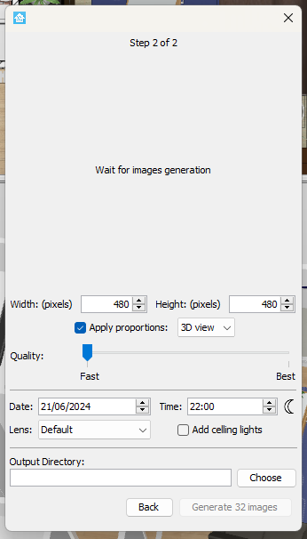
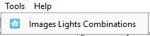

# SweetHome3D Light Combinations Plugin

<div align="center">


</div>

This plugin automatically generates images for all light combinations in a SweetHome3D scene. Users can select which lights to include in the combinations, adjust the power level of each light, and name the lights. The generated names are used to create configurations compatible with the Home Assistant Picture Elements card.

## Features
- **Light Selection**: Choose which lights to include in the generated combinations.
- **Power Adjustment**: Configure the power level of each light.
- **Naming**: Name the lights, which will be used in generating configurations for Home Assistant.
- **Home Assistant Integration**: Create ready-to-use configurations for the Picture Elements card.




## Requirements
- **SweetHome3D**: Version 7.5 or compatible.
- **Java**: Required to run SweetHome3D via CLI (if the plugin doesn't show up in the installer version on Windows).

## Installation

Place the JAR file in the following plugin folder depending on your OS:

- **Windows 11 / 10 / 8 / 7 / Vista**: `C:\Users\user\AppData\Roaming\eTeks\Sweet Home 3D\plugins`
- **Windows XP and older**: `C:\Documents and Settings\user\Application Data\eTeks\Sweet Home 3D\plugins`
- **macOS**: `~/Library/Application Support/eTeks/Sweet Home 3D/plugins`
- **Linux/Unix**: `~/.eteks/sweethome3d/plugins`

### Troubleshooting
If the plugin does not appear in the installer version of SweetHome3D on Windows, you can run SweetHome3D using the JAR version:

```bash
java -jar .\SweetHome3D-7.5.jar
```

## Usage

Once installed, open SweetHome3D and the plugin should appear in the Tools menu. Select the lights you want to include in the combinations, adjust their power levels, and give each light a name. The plugin will then generate images for all possible combinations of the selected lights.



## Home Assistant Integration

Once the image generation is complete, the plugin will add all the generated images and a `home_assistant_config.yaml` file in the folder previously selected. To use the generated results in Home Assistant, follow these steps:

### Steps to Integrate with Home Assistant

1. **Copy Images**:
    - Copy all the generated images to your Home Assistant instance's `www/plans/` folder. If the folder doesn't exist, create it first.

   For example:
   ```bash
   www/plans/
   ├── ha-generated-0.jpg
   ├── ha-generated-1.jpg
   └── ...
   ```

2. **Create a Picture Elements Card**:
    - In your Home Assistant dashboard, create a new "[Picture Elements](https://www.home-assistant.io/dashboards/picture-elements/)" card.
    - Open the `home_assistant_config.yaml` file, which was generated alongside the images.
    - Copy the configuration from `home_assistant_config.yaml` and paste it into the Picture Elements card configuration in Home Assistant.

Now, you should have a fully functional Picture Elements card displaying all the light combinations generated by the plugin!

3. **Optional**: 
   - You can refresh the home assistant configuration

 
## Credit

This project was inspired by the work of sergiocasero and their project [sweet_home_3d_ha_lightning](https://github.com/sergiocasero/sweet_home_3d_ha_lightning).