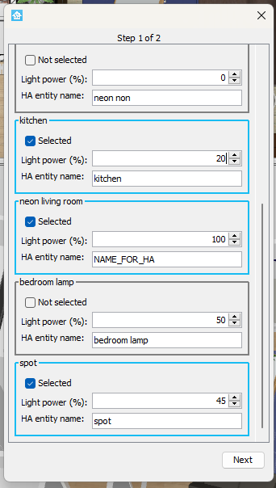

# SweetHome3D Images Lights Combinations Plugin

This plugin automatically generates images for all light combinations in a SweetHome3D scene. Users can select which lights to include in the combinations, adjust the power level of each light, and name the lights. The generated names are used to create configurations compatible with the Home Assistant Picture Elements card.

## Features
- **Light Selection**: Choose which lights to include in the generated combinations.
- **Power Adjustment**: Configure the power level of each light.
- **Naming**: Name the lights, which will be used in generating configurations for Home Assistant.
- **Home Assistant Integration**: Create ready-to-use configurations for the Picture Elements card.




## Requirements
- **SweetHome3D**: Version 7.5 or compatible.
- **Java**: Required to run SweetHome3D via CLI (if the plugin doesn't show up in the installer version on Windows).

## Installation

Place the JAR file in the following plugin folder depending on your OS:

- **Windows 11 / 10 / 8 / 7 / Vista**: `C:\Users\user\AppData\Roaming\eTeks\Sweet Home 3D\plugins`
- **Windows XP and older**: `C:\Documents and Settings\user\Application Data\eTeks\Sweet Home 3D\plugins`
- **macOS**: `~/Library/Application Support/eTeks/Sweet Home 3D/plugins`
- **Linux/Unix**: `~/.eteks/sweethome3d/plugins`

### Troubleshooting
If the plugin does not appear in the installer version of SweetHome3D on Windows, you can run SweetHome3D using the JAR version:

```bash
java -jar .\SweetHome3D-7.5.jar
```

## Usage

Once installed, open SweetHome3D and the plugin should appear in the Tools menu. Select the lights you want to include in the combinations, adjust their power levels, and give each light a name. The plugin will then generate images for all possible combinations of the selected lights.


## Credit

This project was inspired by the work of sergiocasero and their project [sweet_home_3d_ha_lightning](https://github.com/sergiocasero/sweet_home_3d_ha_lightning).